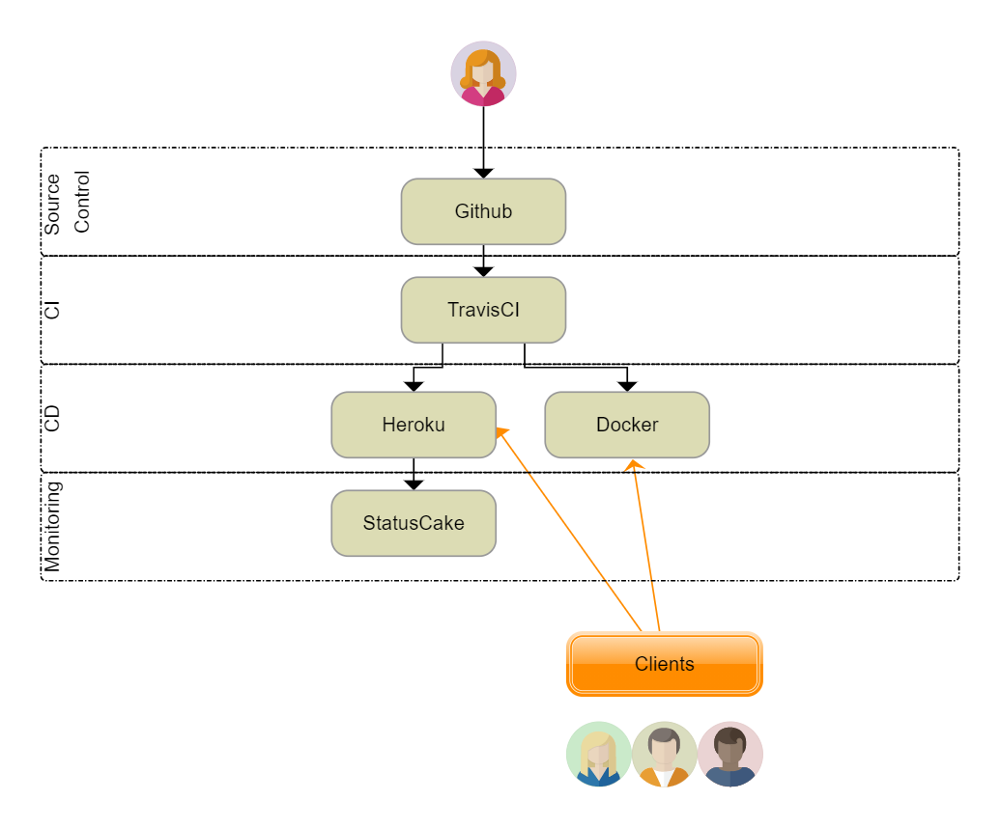

# Proces budowy oprogramowania na potrzeby edukacyjne studiów podyplomowych WSB

## Repozytorium
Kod stworzony na komputerze, za pomocą funkcji git przenoszony jest najpierw do lokalnego repozytorium a następnie  do zdalnego, publicznego repozytorium na GitHub [repozytorium](https://github.com/monikatrznadel/se_hello_printer_app).  
Do odpalenia tej aplikacji wymagany jest Python w wersji 3.

## CI
Do zdalnego repozytorium podłączona jest usługa TravisCI. Travis instaluje zależności z pliku `requirements.txt` oraz `test_requirements.txt`, włącza linter i odpala testy (unit, api oraz smoke).  
Jeśli linter i testy nie zwrócą żadnych błędów - przechodzimy do etapu deploymentu.  
U ustawieniach usługi travis zapisane zostały zmienne środowiskowe umożliwiające przekazanie zbudowanego kontenera Dockera do DockerHub oraz kodu aplikacji do Heroku.

## CD
Na etapie deploymentu nasz zbudowany kod trafia w 2 miejsca:
- DockerHub
- Heroku

TravisCI tworzy kontener dockera który jest publikowany do naszego repozytorium w DockerHub.  
Jednocześnie nasz kod jest wrzucany do repozytorium Heroku skąd jest wdrażany na serwer i dostępny pod adresem [https://stark-mesa-05754.herokuapp.com/](https://stark-mesa-05754.herokuapp.com/)  

## Monitoring
Dostępność naszej aplikacji w chmurze Heroku jest sprawdzana przy pomocy narzędzia StatusCake  

## Diagram

